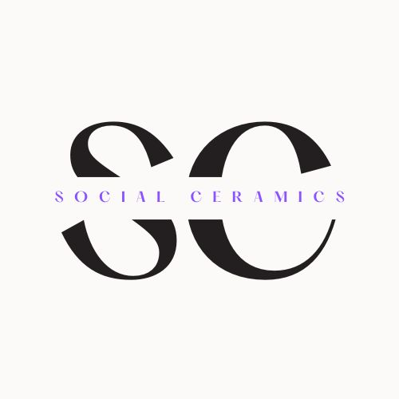

# Social Ceramics

- Link to site

## Table of Contents

## Introduction

I developed the idea for *Social Ceramics* after taking a 12-week pottery class which provided me with so much inspiration not only creatively, but gave me the idea for creating a useful platform for a fictional ceramics studio.

The initial idea was to build a sharing platform, hence the name Social Ceramics, where teachers at the studio could post helpful blog posts that would help the students with their progress, as well as the students being able to share their work, ideas and progress.

## User Experience

### User Stories

#### Site User

#### Site Admin

## Development

## Design

The overall design is fairly minimalist, which I felt created a good base for the content to be viewed clearly and without too many distractions. I created a logo in Canva.

## Features

### Current Features

#### Homepage

##### Navigation

The navigation bar is visible on all pages on the site, allowing clear routing for the user to access all of the site pages and features. The sign-posting is clear.

##### User Authentication

Using Djangos built in authentication system, django-allauth, the user is able to register on the site, log-in and log-out.

If the user is authenticated the features they see differ slightly. For example on the homepage, if the user is logged in, they are prompted to share their work.

If they are not logged in, they are prompted to Sign In.

#### About Page

I created an *About* page which provides the user with an introduction to the studio as well as a *Meet the Team* section with an image and brief bio of the studio teachers.

On a desktop the page looks like this.

On devices smaller than 992px the page looks like this.

I created a media query for smaller devices to maximise accessibility and make sure the content was clearly visible as it looked cramped otherwise.

### Features For Future Implementation

#### Profile

I would like to create a more in-depth profile page for each registered user.

## Issues and Bugs

## Technologies Used

### Languages Used

### Frameworks

- Django
  - Django was the main framework, and the backbone of this project, where I created the models, views and forms for the site.
- Bootstrap

- Cloudinary

### Libraries

- Summernote
- Google Fonts
- Font Awesome

## Testing

## Deployment

### Deploying to Heroku

### Forking the Repository

### Cloning the Repository

## Credits

### Content

### Media

- The Social Cermics logo was created in [Canva](https://www.canva.com/).
  
- All other images used across the site were taken from [Unsplash](https://unsplash.com/), and [Pexels](https://www.pexels.com/).
