# Social Ceramics

- [Link](https://social-ceramics.herokuapp.com/) to live site.

## Table of Contents

## Introduction

I developed the idea for *Social Ceramics* after taking a 12-week pottery class which provided me with so much inspiration not only creatively, but gave me the idea for creating a useful platform for a fictional ceramics studio.

The initial idea was to build a sharing platform, hence the name Social Ceramics, where teachers at the studio could post studio updates and useful blog posts that would help the students with their progress, as well as the students being able to share images that show their work, ideas and progress.

## User Experience


### User Stories


I have categorised my proposed users for this project as the following:

#### Site User

- Current Site User
  - Students who are involved with Social Ceramics and are registered on the platform.
- Prospective Site User
  - Students who are involved with Social Ceramics but aren't yet registered on the platform.
  - Prospective students of Social Ceramics.

As a **Current Site User** I can:
  
- *Log in with my credentials so that I can share my work and view the work of my fellow students.*
- *Navigate through the platform easily so that I can interact with my fellow students.*
- *View blog posts from the studio so that I can gain knowledge, tips and skills to improve my practice.*
- *Comment on blog posts so that I can interact with the teachers and my fellow students.*
- *View the comments made on blog posts by other users so that I can interact with my fellow potters at the studio*.
- *View the work of other students so that I can be active in the Social Ceramics community.*
- *Share my work on the platform so that I can be an active member of the Social Ceramics studio.*
- *Make changes to my shared posts so that I can ensure I share exactly what I want to or edit any spelling mistakes.*
- *Delete my shared posts so that I can share exactly what I want to.*
- *Create a profile so that my experience feels more personal.*

As a **Prospective Site User** I can:

- *View blog posts from the studio so that I can judge whether I want to be more involved in the studio.*
- *Sign up for an account so that I can share my work and view the work of my fellow students.*

#### Site Admin

In this case, the Site Admin are the teachers at the studio. The teachers will be posting blog posts to the site which appear on the homepage and these posts are visible to all users, whether they have created an account on the platform, or whether they are a current student at the studio or a prospective student.

The idea is that the blog posts will cover interesting topics that a ceramics student, or someone who is interested in getting into ceramics, may find useful. This serves the needs of current ceramic students at the studio as the posts will be practical and applicable to their practice. This should also entice prospective students by drawing awareness to the studio.

- As a **Site Admin** I can:

  - *Create, read, update and delete posts so that I can manage the Social Ceramics platform.*
  - *Approve comments on posts so that I can filter objectionable comments.*
  - *Assign staff status to other teachers so that they can create blog posts and manage the Social Ceramics platform.*

## Development

I started the initial planning of the site using Notion, where I wrote down my ideas, user stories and direction for the site including features, which I would then edit down based on viability and to keep on track with an MVP. I found it useful I then created issues, including my user stories which I assigned to the dedicated projects board for the project.

I did find it quite challenging at times but also found it helpful in keeping me focused on the tasks and on track with the overall project.

I also used Figmas FigJam during the planning and development stages which I found helpful to my progress as a visual learner.

I then 

## Design

The overall design is fairly minimalist, which I felt created a good base for the content to be viewed clearly and without too many distractions. I created a logo in Canva which is visible on all pages to maintain consistent branding.


## Features

### Current Features

#### Homepage

##### Navigation

The navigation bar is visible on all pages on the site, allowing clear routing for the user to access all of the site pages and features. The sign-posting is clear and the user can see whether they are signed in or not. If they are not, they will see the *Sign Up* and *Log In* buttons which will direct them to the dedicated pages.

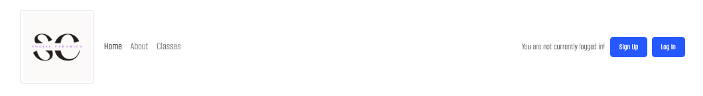

Once they have logged in, they will see a personalised message showing they are logged in, with a *Log Out* button. In this case *Hi admin*, and of course the name will change according to the logged-in user.

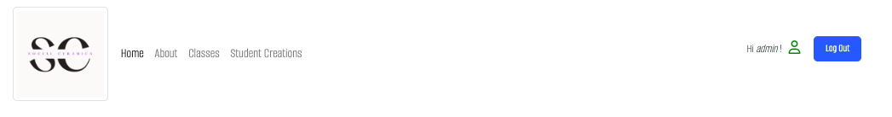

The navigation changes in the instance that they are logged in as the *Student Creations* page is now visible.

##### User Authentication

Using Djangos built in authentication system, django-allauth, the user is able to register on the site, log-in and log-out.

If the user is authenticated the features they see differ slightly. For example on the homepage, if the user is logged in, they are prompted to share their work.
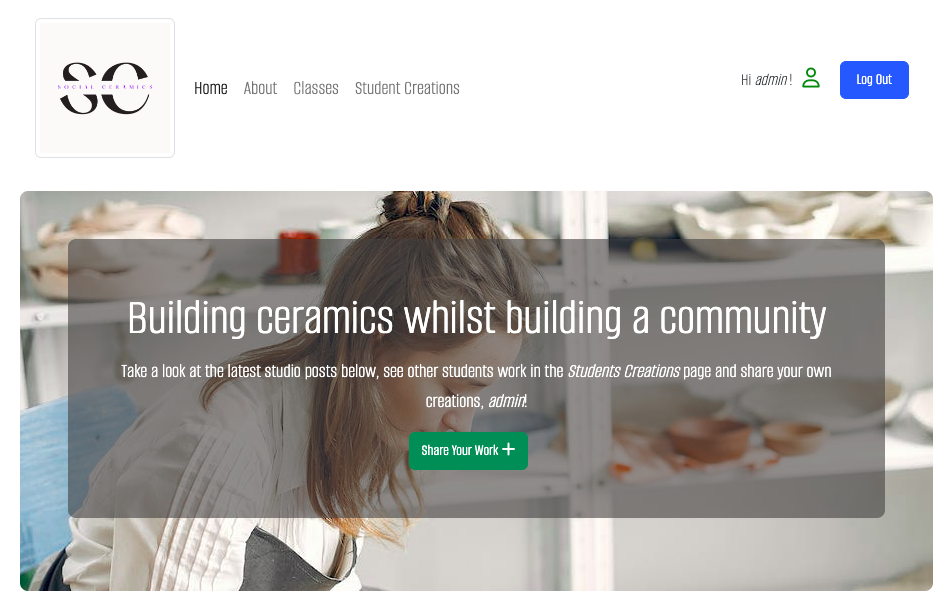

If they are not logged in, they are prompted to Sign In.
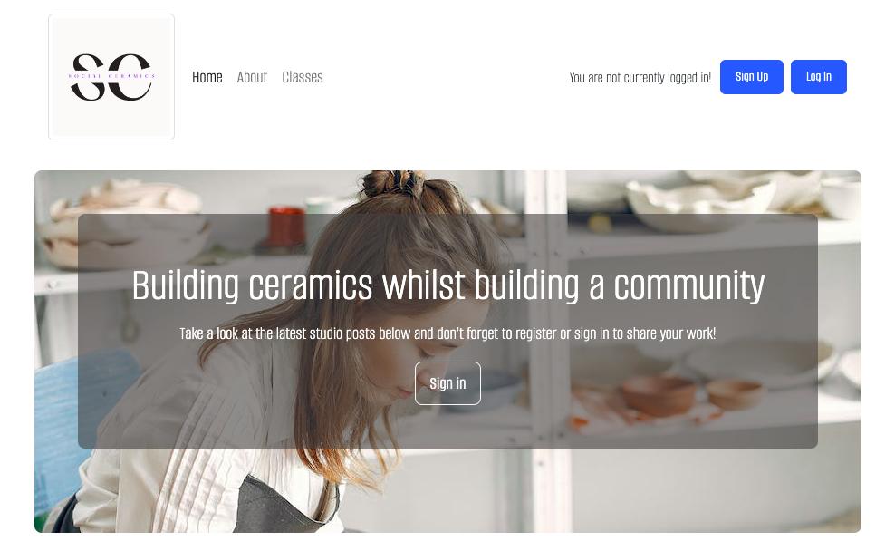

Ideally, I would like to implement an authorisation system so that only students who are involved with the studio, either using the studio space or taking classes, can register for an account. For example, they sign up with credentials which would include selecting the class they are taking, with this information being checked against a database.

Another idea is that they are sent a sign-up link where they can create an account, the sign-up option would then not be visible on the homepage only the option to log-in. This would be more secure, but I haven't looked into that for the purpose of this project!

#### About Page

I created an *About* page which provides the user with an introduction to the studio as well as a *Meet the Team* section with an image and brief bio of the studio teachers.

On a desktop the page looks like this.

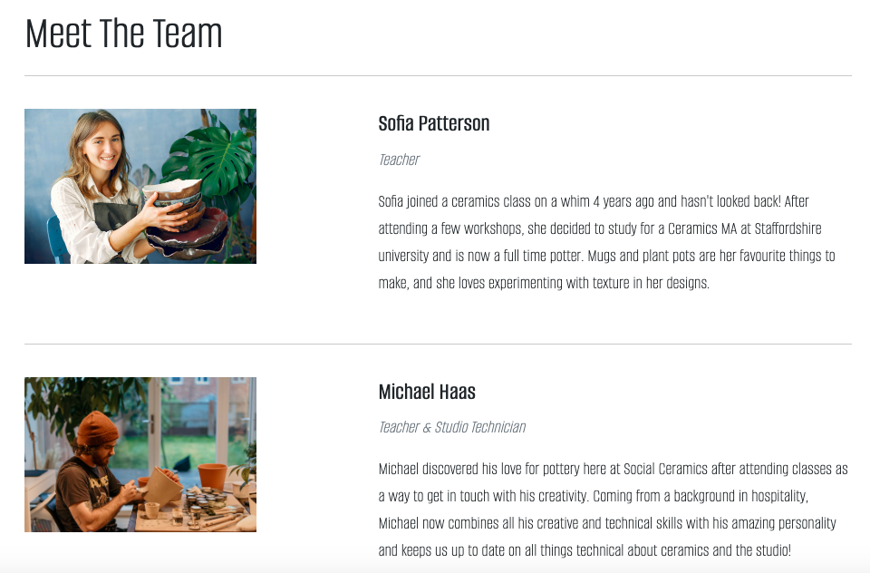

On devices smaller than 992px the page looks like this.

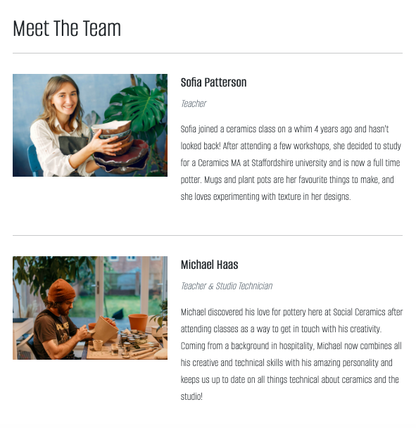

I created a media query for smaller devices to maximise accessibility and make sure the content was clearly visible as it looked cramped otherwise.

#### Share Your Work

Once a student has logged in, they have the option to share their work. This page becomes visible in the navigation bar as well as on the homepage jumbotron.

#### Student Creations Page

Once the user has logged in, the *Student Creations* page is visible in the navigation bar.

This page acts as a feed to display all of the student posts. It is paginated to show 30 posts per page with each row having 3 columns, so 3 posts per row. Each post shows its user, a caption and the image.


The user can click the *view post* button to see the post. If the user is the author of the post, the are provided with the option to make changes to or delete their post. This is not visible to other users so that only the author has access to make any changes.

#### Profile

When a user has created an account, in the navigation bar under the *Profile* dropdown, they are provided with the option to *Create Profile*.

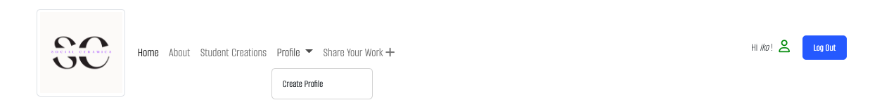

Once they have created a profile, this option changes to *View Profile*.

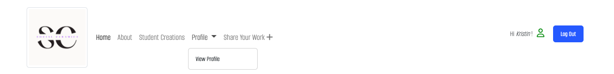

The user can create a profile with the following fields:

- First Name
- Last Name
- Bio
- Profile Picture

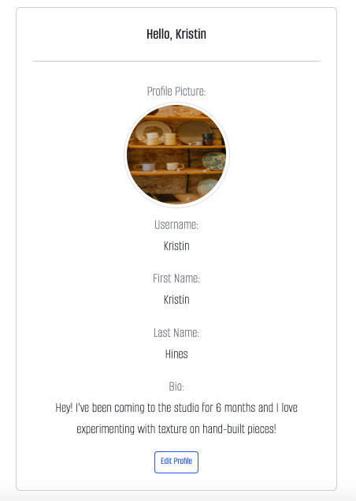

The user can also edit their profile, for example changing their profile picture and editing their bio.

### Future Features

#### Student Profile

I would like to implement the ability for users to view each others profile and wanted to do so in this project but didn't have enough time. I also wanted to provide the user with the ability to delete their profile but haven't yet for the same reason. However, these are things I plan to implement going forward.

#### Classes

When I first developed the idea for this project, I wanted to feature a class booking system where students could log in and book onto classes at the studio. If this project was implemented in reality, I believe that the current set of features 

## Issues and Bugs

### Fixed Issues/Bugs

**Bug** When a user signed up with an email address, an OSError was thrown.

- **Solution** - I added ```ACCOUNT_EMAIL_VERIFICATION = "none"``` in settings.py

**Bug** I had a problem creating one particular blog post from the admin panel which, when published, it through off the layout.
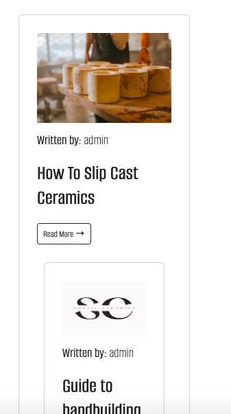

- **Solution** I changed the status of this post to draft, and it went back to normal. I then tested the length of the description, so I edited it down to see if this was causing an issue, but it didn't seem to be. I expected this as I didn't add a max_length to the description field in the post model but wanted to check all options anyway.
  So I then created a new test blog post, and it worked fine.

**Bug** Creating a new blog post with the same title, even if one post was in draft status, threw the following error:

  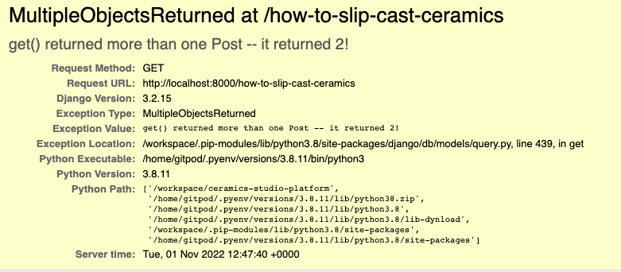

  I have the title and slug fields set to unique=False, but when I changed the title and slug and the issue was solved.

- try except

### Current Issues/Bugs

- When a user comments on a blog post, the comments that are already there disappear. I wasn't able to find a solution to this in time but will look into it in the future.
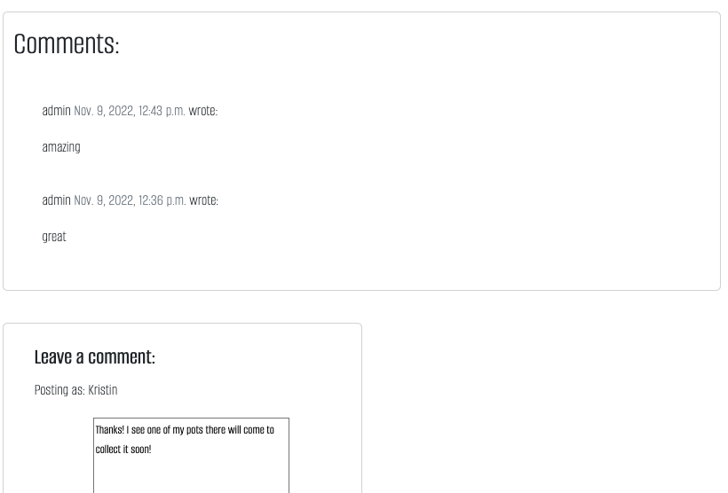

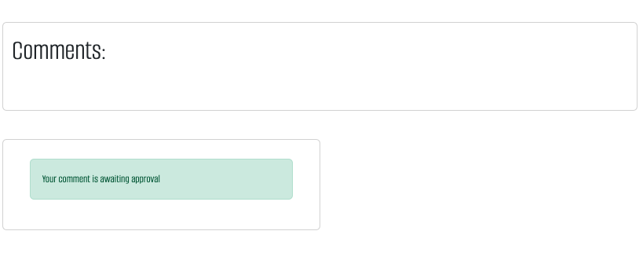

## Technologies Used

- Gitpod was the platform used to develop the project.
- GitHub was used to build and host the repository, build the projects board and track issues.
- Heroku was used to deploy the site.

### Languages Used

- HTML was used for the layout of all templates.
- CSS was used to style the pages and maintaining brand and styling consistent across the site.

### Frameworks

- Django
  - Django was the main framework, and the backbone of this project, where I created the models, views and forms for the site.
- Bootstrap
  - Bootstrap 5 was used to develop a responsive, mobile friendly site using the predefined classes for a clear and consistent layout.

- Cloudinary

### Libraries

- Summernote
  - Summernote was the WYSIWYG editor used to create posts in the Django admin panel for teachers to use.

- Google Fonts
- Font Awesome
  - Font Awesome was used for the icon that appears when a user is logged in.

## Testing

### Lighthouse Testing

## Deployment

### Deploying to Heroku

To deploy the site from the GitHub repository to Heroku, the following steps were taken:

1. Create the Heroku App:
   - Click the 'New' button on the Heroku dashboard.
   - Click 'Create New App':
2. Give the app a unique name:
   - I gave this project the name social-ceramics
3. Select the region:
   - In my case I selected Europe.
4. Add the database:
   - Click on the Resources tab
   - In the 'Add-ons' box search for 'Heroku Postgres' and click it to add it to the project.
   - Select 'Hobby Dev - free' from the 'plan name' dropdown and click 'Submit Order Form'.
5. Prepare the environment:
   - Click on the Settings tab.
   - Click 'Reveal Config Vars' to display the DATABASE_URL.
   - Copy the url next to DATABASE_URL.
   - Return to the GitPod workspace.
   - Create a file called env.py in the main directory.
   - In the env.py file, set the following environment variables:
     - Set the DATABASE_URL by pasting in the url copied from Heroku.
     - Set the SECRET_KEY to your chosen value.
   - Add the SECRET_KEY value to Config Vars in Heroku.
6. Set up settings.py:
   - At the top of the file, add the following:
     - ```import os```
     - ```import dj_database_url```
     - ```if os.path.isfile('env.py'):import env```
   - In the SECRET_KEY section, remove the insecure key and add in the environment variable:
     - ```SECRET_KEY = os.environ.get('SECRET_KEY')```
   - Set up the Postgres database:
     - Delete the value from the DATABASES section and replace it with the following:
     - ```DATABASES = { 'default': dj_database_url.parse(os.environ.get('DATABASE_URL) }```
   - Add Cloudinary libraries into INSTALLED_APPS section:
     - ```INSTALLED_APPS = [ 'cloudinary_storage', 'django.contrib.staticfiles', 'cloudinary' ]```
   - From the Cloudinary dashboard, copy the API Environment Variable by selecting 'copy to clipboard'.
   - In the env.py file, set the CLOUDINARY_URL to the value copied from the clipboard. (Note: Remember to remove the CLOUDINARY_URL= part from the beginning of the copied value.)
   - In your Heroku dashboard, add CLOUDINARY_URL to the Config Vars and paste the value copied from the clipboard.
   - At the end of the settings.py file add the following:
     - ```STATICFILES_STORAGE = 'cloudinary_storage.storage.StaticHashedCloudinaryStorage'```
     - ```STATICFILES_DIRS = [os.path.join.(BASE_DIR, 'static')]```
     - ```STATIC_ROOT = os.path..join(BASE_DIR, 'staticfiles')```
     - ```MEDIA_URL = '/media/'```
     - ```DEFAULT_FILE_STORAGE = 'cloudinary_storage.storage.MediaCloudinaryStorage'```
   - Let Django know where templates will be stored by adding the following to the top of the file, under BASE_DIR:
     - ```TEMPLATES_DIR = os.path.join(BASE_DIR, 'templates')```
   - In the TEMPLATES setting, change the DIRS key to the following:
      - ```'DIRS': [TEMPLATES_DIR]',```
   - Add Heroku host name into ALLOWED_HOSTS:
      - ```ALLOWED_HOSTS = ['appname.herokuapp.com', 'localhost']```
   - Create the following three folders in the main directory:
     - media
     - static
     - templates
   - Create a file named 'Procfile' in the main directory and enter the following in the file:
     - ```web: gunicorn appname.wsgi```
7. Commit and deploy to Heroku:
   - Make an initial commit and push to the GitHub repository:
     - ```git add .```
     - ```git commit -m 'Initial deployment'```
     - ```git push```
   - Return to your Heroku dashboard.
   - Click on the Deploy tab.
   - Select GitHub for deployment method. (note: Connect your GitHub account if it isn't already connected.)
   - In the Connect to GitHub section, search for your repository.
   - Click connect.
   - Scroll down to Manual Deploy.
   - Click 'Deploy Branch'.
   - Once the app has been deployed successfully, you can click 'Open App' to view. You should see a screen with the message 'The install worked successfully! Congratulations!'.

### Forking the Repository

In order to fork the project, the following steps are to be followed:

1. Log in to GitHub.
2. Navigate to the repository.
3. Find the 'Fork' button to the top right of the page.
4. Once you click this button the fork will be in your repositories.

### Cloning the Repository

## Credits

### Content

Content for the blog posts come from:

- [The Little Pot Company](https://thelittlepotcompany.co.uk/blogs/pottery/how-to-centre-clay-the-one-sided-method-beginners-guide)

### Media

- The Social Ceramics logo was created in [Canva](https://www.canva.com/).
  
- All other images used across the site were taken from [Unsplash](https://unsplash.com/), and [Pexels](https://www.pexels.com/).
