# Lighthouse Testing

Below are the results of the Google Lighthouse testing for the site. I tested each page of the site on a mobile device and on a desktop. I also tested each page, when applicable, for when a user was logged in or logged out.

## Homepage | Logged In | Desktop

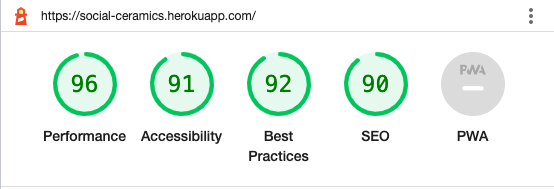

## Homepage | Logged In | Mobile

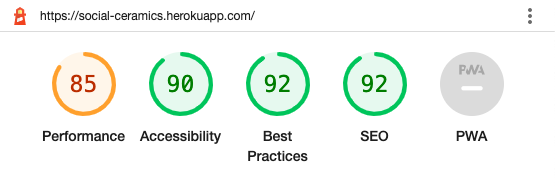

## Homepage | Logged Out | Desktop

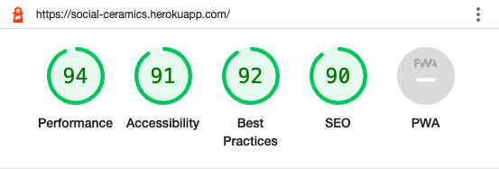

## Homepage | Logged Out | Mobile

## Log In | Desktop

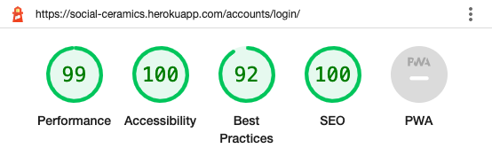

## Log In | Mobile

## Sign Up | Desktop

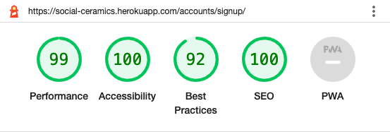

## Sign Up | Mobile

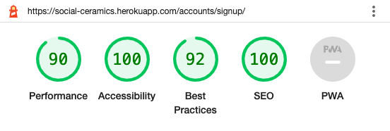

## Log Out | Desktop

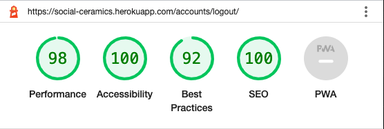

## Log Out | Mobile

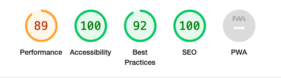

## Post Detail | Logged Out | Desktop

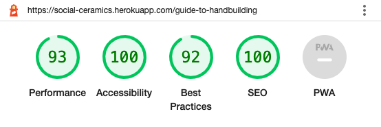

## Post Detail | Logged Out | Mobile

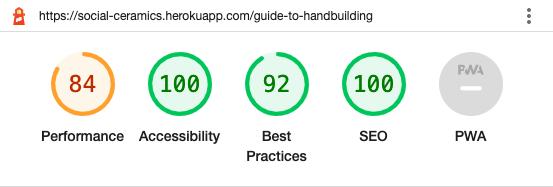

## Post Detail | Logged In | Desktop

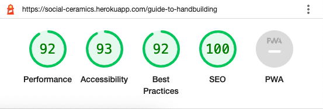

## Post Detail | Logged In | Mobile

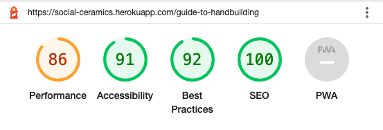

## Student Creations | Desktop

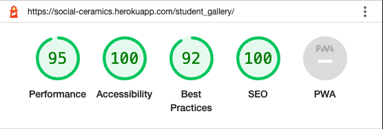

## Student Creations | Mobile

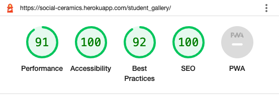

## Image Detail | Desktop

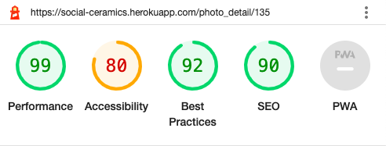

## Image Detail | Mobile

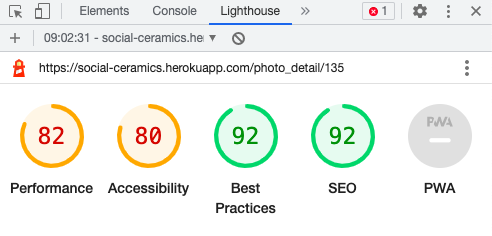

## Share Post | Desktop

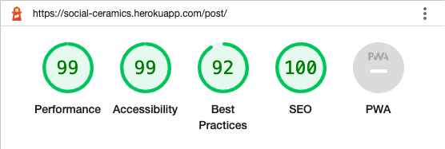

## Share Post | Mobile

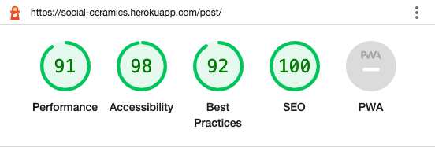

## Create Profile | Desktop

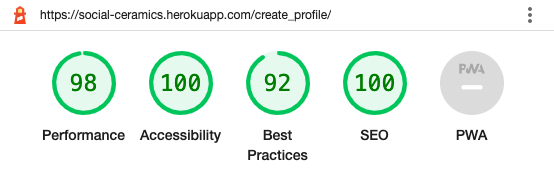

## Create Profile | Mobile

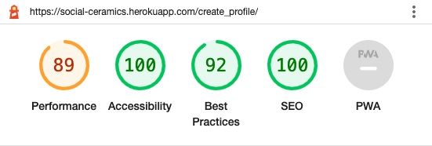

## Edit Profile | Desktop

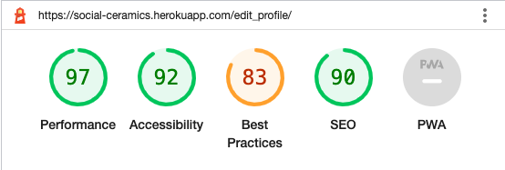

## Edit Profile | Mobile

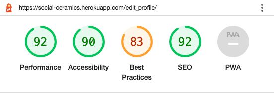

## About | Desktop | Logged In

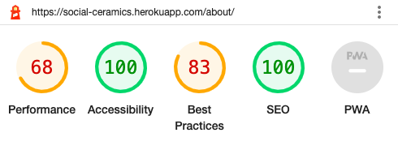

## About | Mobile | Logged In

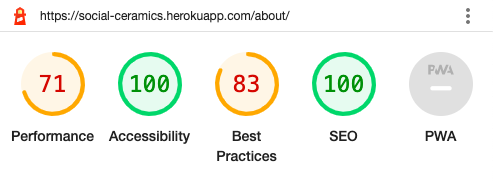

## About | Desktop | Logged Out

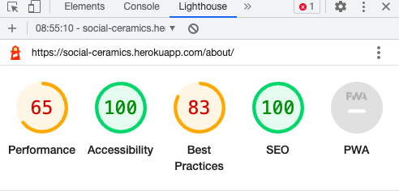

## About | Mobile | Logged Out

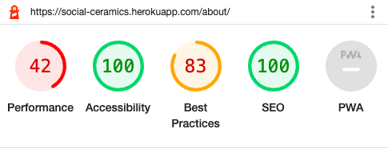

Unfortunately there were some big issues with the about pages which had very low scores on performance and best practices which mostly came down to image sizing. The image links were to the external image source. When I saved the images to my static files and accessed them the links were displayed as broken on the page.

My paths were set up correctly in settings.py and the files were being accessed as they should in the template. After spending a lot of time looking into it and trying different fixes to no avail, I decided to keep the images as they are so that they display for the purpose of the project and due to the time constraints at the time of conducting Lighthouse testing. Going forward I will conduct testing earlier on in development to avoid this problem and will properly implement correct image sizing with Cloudinary.

Overall, the main issues on the other pages were performance on mobile devices. Going forward I will look into image resizing and will also adjust the aspect ratio on the Edit Profile page as this has reduced the score on Best Practices.
